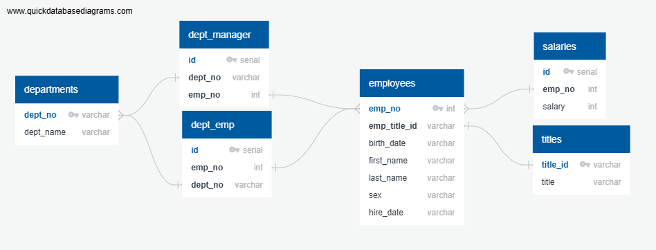

# SQL-challenge

This challenge involves modeling, engineering, and analyzing data using an ERD and SQL Queries.

## Modeling

To model the data, QuickDBD was used, and the chart can be seen below:

## Engineering

The ERD was then used to create the schema for my database. This makes it easy to visualize where foreign keys relate to, and which order tables need to be built in. After establishing an order, creating the tables and importing the data was smooth sailing. After importing all data, I added some serial ID counters to the tables which did not already have their own primary key (in the case of dept_emp.csv and dept_manager.csv, both columns were foreign keys so a primary key had to be added) and then ensured it was all imported correctly. The schema can be found in `schema.sql`. After establishing that the data was usable, I moved on to analysis. 

## Analysis

Once the engineering for the data is done, the analysis is truly quick work. A few joins or subqueries and all of the data comes together to show you what you're looking for. Part of sound analysis is understanding the data you're working with, but another crucial piece is to let the data tell the story, don't make the story for the data. If you can pull it together in a way that relates the data to itself and other relevant data, you can find the story that the data wants to tell. In this challenge, all of the prompts were to utilize the different keys to join or subquery tables to show our ability. All 8 have been completed in full and can be found in `analysis_queries.sql`.
